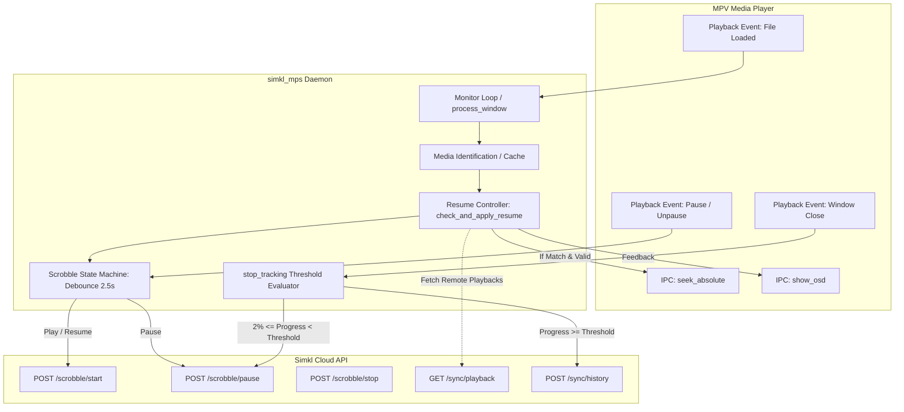

# Simkl Scrobble Lifecycle & Two-Way Playback Resume Specification

- **Date:** 2026-10-03
- **Status:** Approved / Ready for Implementation
- **Target Repository:** ByteTrix/Media-Player-Scrobbler-for-Simkl

---

## 1. Overview & Objectives

Currently, Media Player Scrobbler for Simkl (`simkl_mps`) operates primarily as a one-way scrobbler that reports media items to Simkl history (`POST /sync/history`) only when playback reaches the user's `completion_threshold` (default 80%). If a user closes the player mid-playback, no progress is recorded, leaving Simkl's cross-device **Playback Progress Manager** empty.

This specification defines the design to:
1. **Implement Full Scrobble Lifecycle (Option B):** Report real-time playback state (`start`, `pause`, `stop`) conforming to the official Simkl API specifications.
2. **Dynamic Threshold Integration:** When media stops or the player exits, dynamically compare current progress against `self.completion_threshold`:
   - If progress $\ge$ `completion_threshold`: Mark watched in history.
   - If progress $<$ `completion_threshold` (and $> 2\%$): Send `POST /scrobble/pause` to reliably save the session into Simkl's Playback Progress Manager without triggering premature completion.
3. **Reverse Playback Resume (Continue Watching):** When opening media in MPV, retrieve the user's unfinished playbacks from Simkl (`GET /sync/playback`). If a matching session is found within `[2%, completion_threshold)`, automatically command MPV via IPC to seek to that timestamp and display an on-screen display (OSD) notice.
4. **Configuration & UI Controls:** Provide user options in configuration and the system tray menu to toggle automatic resume and real-time scrobbling.

---

## 2. Architecture & Data Flow



---

## 3. Detailed Component Specifications

### 3.1 Simkl API Client (`simkl_mps/simkl_api.py`)

Add the following functions with standard authentication (`Authorization: Bearer <token>`, `simkl-api-key`, `client_id`, `app-name`, `app-version`, `User-Agent`):

#### 1. `scrobble(action, media_data, progress=None, client_id=None, access_token=None, allow_rewatch=False)`
- **Endpoint:** `POST https://api.simkl.com/scrobble/{action}` where `action in ('start', 'pause', 'stop')`
- **Payload Structure:**
  ```json
  {
    "progress": 42.5,
    "movie": { "title": "...", "year": 2024, "ids": { "simkl": 12345 } }
  }
  ```
  *(Or `show` + `episode` for TV/Anime).*
- **Error Handling:**
  - HTTP `200-299`: Success.
  - HTTP `409 Conflict`: Treated as soft-success (duplicate scrobble protection window).
  - HTTP `400` / `RATE_LIMIT`: Log warning (per-user 20-second collision), do not crash.

#### 2. `get_playback_sessions(client_id, access_token, media_type=None)`
- **Endpoint:** `GET https://api.simkl.com/sync/playback/{media_type}` (`media_type` optional: `episodes`, `movies`)
- **Query Params:** `hide_watched=true`
- **Output:** Parsed list of playback dicts containing `id`, `progress`, `show`, `movie`, `episode`.

#### 3. `get_activities_playback(client_id, access_token)`
- **Endpoint:** `POST https://api.simkl.com/sync/activities`
- **Purpose:** Lightweight check to inspect `activities.playback` timestamp before making expensive calls to `get_playback_sessions`.

---

### 3.2 Scrobble State Machine & Dynamic Threshold (`simkl_mps/media_scrobbler.py`)

#### 1. State Tracking & Debouncing
- Maintain `self._scrobble_state` (`IDLE`, `PLAYING`, `PAUSED`).
- Introduce a 2.5-second debounce timer (`threading.Timer`) for pause/resume toggles to prevent spamming Simkl when users tap spacebar repeatedly:
  - When pause is detected: Start timer for 2.5s. If still paused when timer fires, call `scrobble('pause', progress=...)`.
  - When unpaused: Cancel pending pause timer. If previous state was confirmed paused, call `scrobble('start', progress=...)`.

#### 2. `stop_tracking()` Threshold-Linked Finalization
When a media session stops (player closed or media changed):
- Cancel any pending debounce timer.
- Calculate final completion percentage: `completion_pct = self._calculate_percentage(use_position=True)`.
- **Branch A (Completed):**
  - If `completion_pct >= self.completion_threshold`:
    - Call existing `self._attempt_add_to_history()`.
    - Simkl auto-cleans any associated playback session once the item is added to history.
- **Branch B (Unfinished - Save to Playback Manager):**
  - If `not self.completed` and `2.0 <= completion_pct < self.completion_threshold`:
    - Call `scrobble('pause', media_data, progress=completion_pct)`.
    - **Rationale:** Using `/scrobble/pause` rather than `/scrobble/stop` guarantees that Simkl saves the session as a resumable playback regardless of whether `completion_threshold` is configured to 65%, 80%, 90%, or higher, avoiding Simkl's server-side hardcoded 80% stop-completion rule.
- **Branch C (Accidental / Trivial Click):**
  - If `completion_pct < 2.0` or watch time $< 30$ seconds, silently reset local state without calling Simkl.

---

### 3.3 MPV Control & Reverse Playback Resume (`simkl_mps/players/mpv.py` & `media_scrobbler.py`)

#### 1. MPV IPC Enhancements (`simkl_mps/players/mpv.py`)
Add methods:
- `seek_absolute(target_seconds: float) -> bool`:
  Sends command `["seek", round(target_seconds, 2), "absolute"]`.
- `show_osd(text: str, duration_ms: int = 3500) -> bool`:
  Sends command `["show-text", text, duration_ms]`.

#### 2. Resume Workflow (`media_scrobbler.py`)
When a new media item is identified:
1. Check `enable_playback_resume` config setting. If False, skip.
2. Query cached/remote playback sessions for matching `simkl_id` (and matching `season`/`episode` if show).
3. If a matching remote session exists with `remote_progress`:
   - Verify validity: `2.0 <= remote_progress < self.completion_threshold`.
   - Verify current player position: player must be near the beginning (`current_position <= 15` seconds).
   - If player `duration` is not yet available (`None` or `0`), register a one-shot pending resume flag `_pending_resume_target = remote_progress`.
   - As soon as `duration` is reported in subsequent poll:
     - `target_seconds = (remote_progress / 100.0) * duration`
     - If `abs(current_position - target_seconds) > 5.0`:
       - Execute `player.seek_absolute(target_seconds)`.
       - Execute `player.show_osd(f"[Simkl] Resumed at {int(remote_progress)}% ({format_time(target_seconds)})")`.
     - Set `_resumed_current_item = True` to prevent repeated seeking.
     - Call `scrobble('start', progress=remote_progress)`.

---

### 3.4 Configuration & Tray Menu Settings (`config_manager.py` & `tray_base.py`)

1. **New Configuration Options in `config.ini`:**
   - `enable_realtime_scrobble` (bool, default `True`)
   - `enable_playback_resume` (bool, default `True`)
   - `resume_start_tolerance_seconds` (int, default `15`)
2. **Tray Menu Additions:**
   - Under `Scrobbling` menu:
     - Checkbox: `Auto-Resume from Simkl` (toggles `enable_playback_resume`).
     - Checkbox: `Realtime Scrobbling (Watching Now)` (toggles `enable_realtime_scrobble`).

---

## 4. Edge Cases & Resilience

1. **Simkl 20-Second Per-User Lock:**
   - Mitigated by the 2.5s debounce timer. Rapid spacebar presses collapse into a single event.
2. **Network Offline / Disconnections:**
   - If network request fails during pause/stop on player exit, catch `requests.RequestException`, log at debug level, and proceed with clean shutdown. (Ephemeral pause states should not block app teardown or cause crashes).
3. **Local MPV `watch-later` Conflict:**
   - If MPV's native `save-position-on-quit` already resumed playback to within $\pm 5$ seconds of Simkl's target timestamp, skip sending `seek_absolute` to avoid jarring jumps.
4. **Custom `completion_threshold`:**
   - Dynamically reads `self.completion_threshold` at all check points. Never hardcode 80%.

---

## 5. Testing & Verification Plan

1. **Unit Tests:**
   - `test_simkl_api_scrobble.py`: Mock API calls for `/scrobble/start`, `/scrobble/pause`, `/scrobble/stop`, and `/sync/playback`.
   - Test threshold logic:
     - Stop at 75% with 80% threshold $\rightarrow$ verifies `/scrobble/pause` called.
     - Stop at 85% with 80% threshold $\rightarrow$ verifies `_attempt_add_to_history` called.
     - Stop at 85% with 90% threshold $\rightarrow$ verifies `/scrobble/pause` called.
2. **Player Integration Tests:**
   - Test `seek_absolute` and `show_osd` with mock named pipe / socket responses.
3. **Manual / End-to-End Test:**
   - Play a video in MPV to 45%, close MPV.
   - Verify Simkl Playback Progress Manager shows 45%.
   - Open the same video in MPV.
   - Verify MPV jumps to 45% and displays OSD notification.

---

## 6. Implementation Adjustments (2026-10-03)

Found while reading the code to write the implementation plan. These supersede the corresponding statements above.

1. **Settings storage:** settings live in `settings.json` via `config_manager` (`get_setting` / `set_setting` / `DEFAULT_SETTINGS`), not `config.ini`.
2. **Debounce:** `Monitor` already polls every 10 s, so no `threading.Timer` is needed. `MediaScrobbler` reconciles the *desired* state (`start` / `pause`) against the *last reported* state on each poll, with a 2.5 s minimum spacing between calls. A failed call (e.g. `400 RATE_LIMIT`) leaves the state unreported, so the next poll retries.
3. **Resume tolerance:** default `resume_start_tolerance_seconds` is **30** instead of 15, because the first poll that sees a duration can happen 10-20 s after the file opens.
4. **No activities gate:** the `/sync/activities` playback-timestamp gate is dropped. Its exact JSON path is undocumented, and opening a file is a user action, so a single `GET /sync/playback[/episodes|/movies]` per opened item is acceptable.
5. **Pause detection for MPV:** the existing title-keyword `_detect_pause` never fires for stock MPV. For MPV and MPV wrappers the integration's `is_paused()` IPC call is used, falling back to the title check.
6. **`allow_rewatch` on scrobble:** not implemented. Unfinished items use `pause`, and completed items go through `/sync/history`, so `stop` is never called.
7. **Stale playback cleanup:** Simkl documents clearing a saved playback only for `/scrobble/stop >= 80`. After an item completes through `/sync/history`, a previously saved pause is deleted explicitly with `DELETE /sync/playback/{id}`.
8. **`stop_tracking()` timing:** it usually runs after the player has already exited, so the report uses the last polled position (up to 10 s stale).
