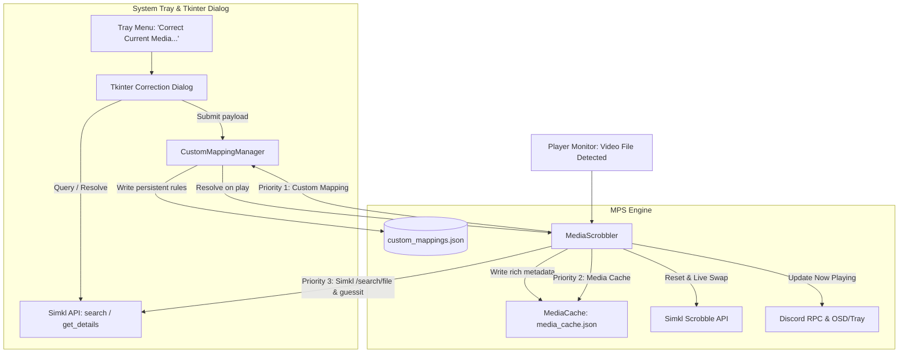

# Manual Media Correction & Persistent Mapping Specification

- **Date:** 2026-10-09
- **Status:** Approved / Ready for Implementation
- **Target Repository:** JinxAgain/Media-Player-Scrobbler-for-Simkl

---

## 1. Overview & Objectives

Currently, Media Player Scrobbler for Simkl (`simkl_mps`) identifies video files automatically using filename parsing (`guessit`), directory structures, and the Simkl API endpoints (`/search/file`, `/search/movie`). 

However, automatic filename matching can fail or yield incorrect matches in several common situations:
1. Obscure, niche, or older anime/dramas without recognized file hashes or standardized naming in Simkl.
2. Ambiguous titles where a reboot, spin-off, or special shares keywords with a main series.
3. Multi-season releases where files use absolute episode numbers (e.g. Episode 25) instead of season-relative numbering (e.g. S02E01).

When an item is misidentified or unidentified, scrobbling either halts or corrupts the user's Simkl watch history with wrong entries.

### Objectives:
1. **Provide an Error-Prevention & Manual Correction Mechanism**: Allow users to manually correct an unidentified or misidentified media item to the exact Simkl entry.
2. **Non-Intrusive Workflow**: Do not interrupt fullscreen video playback. If an item fails to match, issue a lightweight desktop notification. Manual correction is triggered intentionally by the user via the system tray menu (`Correct Current Media...`).
3. **Unified Tkinter Dialog (Zero External UI Dependencies)**: Provide a clean, native dialog built purely with Python's standard `tkinter` library. It supports three input methods:
   - Pasting a Simkl web URL (e.g. `https://simkl.com/anime/2095944/...`).
   - Entering a numerical Simkl ID (e.g. `2095944`).
   - Typing search keywords to query Simkl and selecting from an interactive candidate list.
4. **Smart Two-Tier Persistence**:
   - Store rules in a dedicated `custom_mappings.json` file, isolated from volatile caches so clearing cache never erases user rules.
   - Support exact file mappings as well as series-level rules (matching parent folder or title) so subsequent episodes of the same show inherit the correct Simkl Show ID automatically.
5. **Runtime Hot Reload (Live Swap)**: Immediately apply the correction to the active playback session:
   - Cancel/delete any wrong pending scrobble playback session on Simkl (`DELETE /sync/playback`).
   - Update `MediaScrobbler` internal state and disk cache (`media_cache.json`).
   - Immediately update Discord Rich Presence and system tray status with the corrected metadata.
   - Initiate a fresh scrobble session for the correct Simkl ID at the current playback position.

---

## 2. Architecture & Data Flow



---

## 3. Data Model & Persistent Storage (`custom_mappings.json`)

Custom mapping rules are stored in `custom_mappings.json` under the application data directory (`get_app_data_dir()`).

### JSON Schema
```json
{
  "version": 1,
  "exact_files": {
    "dune.part.two.2024.1080p.mkv": {
      "simkl_id": 1690042,
      "type": "movie",
      "title": "Dune: Part Two",
      "year": 2024,
      "poster_url": "https://simkl.in/posters/...",
      "created_at": "2026-10-09T16:20:00Z"
    },
    "sousou_no_frieren_04.mkv": {
      "simkl_id": 2095944,
      "type": "anime",
      "title": "Frieren: Beyond Journey's End",
      "season": 1,
      "episode": 4,
      "created_at": "2026-10-09T16:20:00Z"
    }
  },
  "show_rules": {
    "sousou no frieren": {
      "simkl_id": 2095944,
      "type": "anime",
      "title": "Frieren: Beyond Journey's End",
      "default_season": 1,
      "folder_keyword": "frieren",
      "created_at": "2026-10-09T16:20:00Z"
    }
  }
}
```

### Resolution Strategy in `CustomMappingManager.resolve(filepath, raw_title, guessit_info)`:
1. **Tier 1 (Exact File Match)**:
   - Normalize the filename base (`os.path.basename(filepath).lower()`).
   - If present in `exact_files`, return the saved mapping directly (`simkl_id`, `type`, `title`, `season`, `episode`).
2. **Tier 2 (Series / Show Match)**:
   - Check if `show_rules` match either:
     - The parent directory name (e.g. `os.path.basename(os.path.dirname(filepath)).lower()`).
     - Or the `guessit_info.get('title')` (lowercased).
   - If matched:
     - Use the rule's `simkl_id`, `type`, and canonical `title`.
     - Extract `episode` dynamically from the current filename (via `guessit` or regex).
     - Extract `season` dynamically from filename, falling back to `rule.get('default_season', 1)`.
3. **Tier 3 (No Match)**:
   - Return `None`, allowing normal identification pipelines (`media_cache.json` -> `/search/file` -> `/search/movie`) to proceed.

### Thread Safety & Concurrency
- `CustomMappingManager` wraps read/write operations with a `threading.Lock`.
- Saves are performed atomically via writing to a temporary file (`.tmp`) and replacing the destination to prevent partial file writes.
- If the file is corrupted (e.g. invalid JSON from manual user edit), it backs up the file to `custom_mappings.json.corrupted` and initializes a fresh configuration without crashing the application.

---

## 4. User Interface & Dialog Workflow

### 1. Tray Menu Integration
- **Under `Scrobbling` Submenu**:
  - `Correct Current Media...`: Enabled whenever there is active playback or a last-tracked media item.
- **Under `Maintenance` Submenu**:
  - `Open Custom Mappings`: Opens `custom_mappings.json` in the user's default text editor.

### 2. Tkinter Modal Dialog (`CorrectionDialog`)
- **Header**:
  - Displays currently detected filename/path and current matching status (e.g., `Unidentified` or `Current: [Title] (ID: 12345)`).
- **Search & Input Field**:
  - Handles 3 formats in a single entry:
    1. **Simkl URL**: e.g., `https://simkl.com/anime/2095944/frieren...` or `https://simkl.com/tv/123/...` or `https://simkl.com/movies/456/...`.
       - Regex extracts the media type and Simkl ID.
       - Asynchronously fetches title, year, and poster via Simkl API.
    2. **Numeric Simkl ID**: e.g. `2095944`.
       - Asynchronously fetches details from Simkl API.
    3. **Text Query**: e.g., `Frieren`.
       - Clicking "Search" queries `/search/movie`, `/search/tv`, and `/search/anime`.
       - Populates the interactive `Listbox` with up to 5-10 candidate items:
         `[Anime] Frieren: Beyond Journey's End (2023) - ID: 2095944`
- **Season & Episode Overrides (For TV / Anime)**:
  - `Season`: Number entry (pre-filled with current detected season).
  - `Episode`: Number entry (pre-filled with current detected episode).
  - Disabled/hidden when media type is `movie`.
  - Checkbox: `[✔] Apply to all episodes of this series (Save series rule)` (Checked by default for TV/Anime).
- **Execution & Responsiveness**:
  - All network calls (Simkl search and details fetch) run in a background daemon thread.
  - Updates the Tkinter GUI thread via `root.after()`.
  - Displays inline loading status ("Searching Simkl...") and inline error messages on network failure.

---

## 5. MediaScrobbler Integration & Runtime Live Swap

When the user submits a correction in the dialog while media is playing:

1. **Rule Persistence**:
   - Calls `CustomMappingManager.add_exact_mapping(...)`.
   - If "Apply to all episodes" is checked, calls `CustomMappingManager.add_show_rule(...)`.
2. **Cache Updating**:
   - Populates `MediaCache` with the full details payload for the active cache key so subsequent fast lookups succeed immediately.
3. **Simkl Active Session Invalidation**:
   - If a previous scrobble session (`/scrobble/start` or `/scrobble/pause`) was recorded under an incorrect `simkl_id`:
     - Calls `delete_playback` on Simkl to erase the erroneous playback state from the user's Simkl account.
4. **MediaScrobbler State Hot Reload**:
   - Updates instance fields: `simkl_id`, `movie_name`, `media_type`, `season`, `episode`, `display_season`, `display_episode`, `poster_url`.
   - Resets scrobble session debounce trackers: `_scrobble_reported_state = None`, `_last_scrobble_attempt = 0`, `completed = False`.
5. **Immediate Notification & Service Sync**:
   - Sends desktop notification: `Media Corrected: Tracking '{title}' S{season}E{episode}`.
   - Refreshes Discord Rich Presence immediately with the updated title, episode, and poster.
   - Issues a fresh `POST /scrobble/start` to Simkl with the current playback timestamp and duration.

---

## 6. Error Handling & Edge Cases

| Edge Case | Handling Behavior |
|-----------|-------------------|
| User offline during correction | Allows entering known numerical Simkl ID and saving. Mapping is saved locally; scrobbling syncs once connectivity resumes. |
| Invalid URL pasted (e.g. Netflix / IMDb) | Displays inline warning: *"Please paste a valid Simkl link (e.g., https://simkl.com/anime/...) or enter a Simkl ID."* |
| Player closes while dialog is open | Dialog remains open; saving still persists the rule for that filename and series for future playback. |
| Corrupt `custom_mappings.json` | Backs up bad file to `custom_mappings.json.corrupted`, initializes clean dictionary, logs error, avoids crashing. |
| Single-episode movie mistaken for series | User selects "Movie" in search results, Season/Episode inputs are automatically hidden/disabled. |

---

## 7. Automated Testing Plan

Tests will be added following the repository's `poetry run pytest` suite:

1. **`test_custom_mapping_manager.py`**:
   - Test adding and retrieving exact file mappings.
   - Test show-level rule matching by parent directory and guessit title.
   - Test priority: exact file mapping overrides show-level rule.
   - Test JSON persistence, reload, atomic writes, and corrupt file recovery.
2. **`test_media_scrobbler_custom_mapping.py`**:
   - Test `_identify_media_from_filepath` uses custom mapping before hitting Simkl search API.
   - Test `apply_manual_correction`:
     - Verifies previous wrong playback session is deleted on Simkl if applicable.
     - Verifies `simkl_id`, `movie_name`, and episode metadata update immediately.
     - Verifies Discord RPC is re-triggered with the new metadata.
3. **`test_correction_dialog_logic.py`**:
   - Test URL regex parsing across various Simkl URL formats (`/anime/`, `/tv/`, `/movies/`).
   - Test search result filtering and extraction logic.
